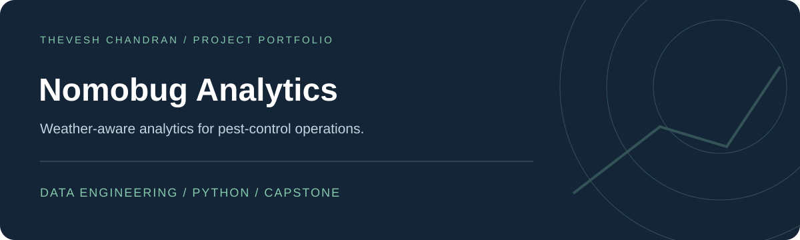
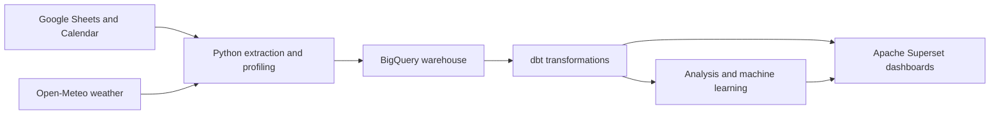

<h1 align="center">Nomobug Analytics</h1>

Weather-aware analytics for pest-control operations.

<a href="#overview">Overview</a> · <a href="#explore">Explore</a> · <a href="#getting-started">Getting started</a>

## Overview

An ongoing Sunway University capstone project exploring how operational, service-outcome, scheduling, location and weather data can support pest-control management decisions.

The intended system will help investigate recurring service problems, weather-associated patterns and geographic hotspots through analysis and dashboards.

## Explore

| Public repository content | Purpose |
|---|---|
| [Calendar extraction prototype](scripts/fetch_calendar_events.py) | Read selected events and parse booking details |
| [Weather retrieval prototype](scripts/test_open_meteo_history.py) | Explore historical Open-Meteo weather data |
| [Implementation notes](CP2_START_HERE.md) | Initial CP2 planning and build order |
| [Data workspace](data/) | Data-handling guidance and placeholders |

## Current progress

The local CP2 project has reached live-source integration: an initial prospects API-to-Neon PostgreSQL load and unchanged-snapshot rerun were verified with 32,580 rows. A BigQuery loader is prepared; live migration remains pending.

**This public repository contains the earlier extraction prototypes and planning material.** The newer local pipeline is not included here. Transformations, predictive modelling, clustering and hosted dashboards remain in development or planned.

## Planned architecture

The current plan uses Python/Pandas, BigQuery, dbt Core, scikit-learn, GitHub Actions and Preset-hosted Apache Superset. Neon PostgreSQL remains a manual fallback. The diagram describes the planned system, not a completed deployment.

## Getting started

Start with the [implementation notes](CP2_START_HERE.md) and inspect the source prototypes. They require source-specific configuration, credentials and further validation; there is no complete public one-command application to launch yet.

## Data handling

Raw company exports, customer or employee data, credentials and identifying generated outputs stay outside version control. Use anonymised or synthetic samples for shared tests and examples.
